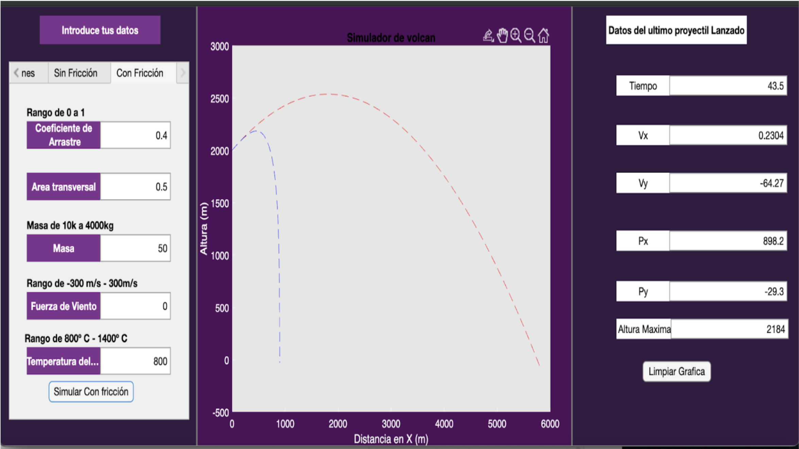

# Matlab-Projects
Repository for projects developed in Matlab

# Volcanic Eruption Simulator 🌋
MATLAB simulation of volcanic eruptions its projectiles launched by the volcano.

# Simulation of energy loss in a F1 circuit 🏎️
This project simulates a Formula 1 track, using a cubic polynomial to design the curves. It calculates energy loss and circuit dynamics to predict if a car will skid off the track.  

 

# Calculation and Graphing of Non-Uniform Electric Fields ⚡🦟
This project models the electric field generated by oppositely charged plates to simulate dielectrophoresis, aiding in the diagnosis of malaria by visualizing the electric field behavior for improved understanding and detection.

 

# Magnetic Field Visualization of a Current-Carrying Ring 🧲
It calculate and graph the magnetic field produced by a ring along the z/y axis. The code allows for variations in current, ring radius, and vector quantities, providing a visual representation of the magnetic field generated by the ring.

 

